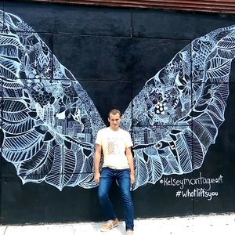

[Striderfly.xxx](https://striderfly.j0wy.com)
==========


## Installation
```
npm install && npm start
```

That builds the site and serves it at http://localhost:8787, rebuilding when you change a file. Requires Node.js 22 or later.

## Stack
Static HTML on Cloudflare Workers (Static Assets), built with a small Node script and Hogan.js, deployed with the `cf` CLI.

## Adding your page
Every contributor gets a folder in `contributors/`, with their page, assets and a `contributor.json` that puts them on the homepage. See [CONTRIBUTING.md](CONTRIBUTING.md) for how to add yours and open a pull request.

## Deploying
The site is a static-assets-only Cloudflare Worker at https://striderfly.j0wy.com. `build.js` copies `public/` and every contributor folder into `dist/`, and renders the homepage and 404 page from `views/`. Configuration is in `cloudflare.config.ts` and `wrangler.config.ts`.

The site asks search engines not to index it: `public/_headers` sends `X-Robots-Tag: noindex, nofollow` with every response. There's deliberately no `robots.txt` blocking crawlers, since a crawler that can't fetch a page never sees its noindex header.

Visits are counted with Cloudflare Web Analytics, which is turned on for the j0wy.com zone and doesn't use cookies.

```
npm run deploy
```

Deploying needs a `cf` login for the Cloudflare account that owns j0wy.com: `cf auth create <profile>`, then `cf auth activate <profile>` in this folder.

## License
The code is released under the [MIT License](LICENSE). That covers what Striderfly's contributors wrote, not the third-party material bundled with it:

* Libraries and fonts keep their own licenses: Phaser, Crafty, jQuery and prefix-free are MIT, and Gloria Hallelujah and Press Start 2P are under the SIL Open Font License (included next to each font).
* FlappyBK is based on [hyspace/flappy](https://github.com/hyspace/flappy), and the Jump game on Kushagra Agarwal's CSSDeck demo.
* Game art, sounds, logos and photos that came from elsewhere, including the Flappy Bird, Frogger and Burger King artwork and the homepage photo, belong to their owners and aren't covered by the MIT License. If something here is yours and you'd like it removed, open an issue.
